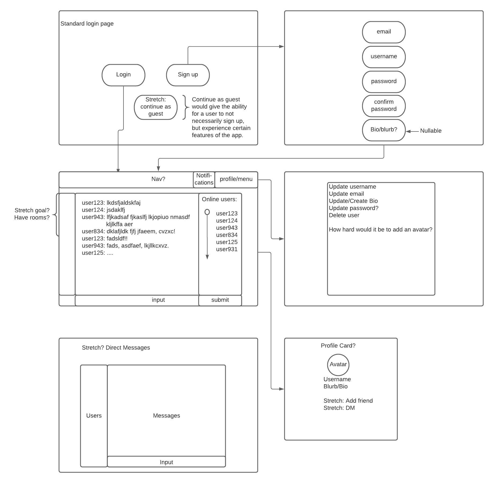

# zerochat (0chat)

## About

"Cyberspace. A consensual hallucination experienced daily by billions of legitimate operators, in every nation, by children being taught mathematical concepts... A graphic representation of data abstracted from banks of every computer in the human system. Unthinkable complexity. Lines of light ranged in the nonspace of the mind, clusters and constellations of data. Like city lights, receding..."

― William Gibson, Neuromancer

Ever since I was a small kid, I was absolutely love in science fiction and the genre that was called cyberpunk. It began when I picked up a Shadowrun book at Half Price Books and begged my mom to buy it for me when I was in middle school. I didn't even know what an RPG was, but I read the book from cover to cover. 

I suppose, in a sense, that's why I'm also here at General Assembly. My love of a genre extended to a general curiosity about how things work, especially technology. I was always blown away by scenes from the movie Hackers, Johnny Mnenomic, etc. etc., even though that's how none of this works.

So when we were given the chance to be creative, go wild, I decided I still wanted to tinker, I still wanted to explore, and I wanted to learn more about the place that William Gibson et al called cyberspace, which we call 'the internet.' What better and bigger of a headache to do this than socket.io.

zeroChat is a websocket chat application with a cyberpunk theme and twist to it. Rooms are created for individuals to chat in, and they only exist as long as they are needed; they are ephemeral. I hope to one day add AES256 once I figure out how to make a static ephemeral key so that the users are truly safe in their communications.

See you, Space Cowboy.

## Technologies

* React.js
* socket.io
* HTML5
* CSS3

## Link to the Backend

[zeroChat backend](https://github.com/mgcarbonell/zerochat-backend)

## Screenshots

## Wireframes

## ERD

## Future Development

* AES256 real time encryption.
* Add a friend system.
* Allow users to view other users' profiles (for bio).
* Restyle appbar to look like a Win95 appbar.
* Some more styling, integrating another frontend framework, and overriding Material-UI more.
* Fix the chat room.

## Credits

Credit is given where credit is due:

Thank you again to... 

* Brock Whitbread-Cole for the idea and support with SocketIO.
* James Sinkler for steering me away from something mediocre, and for the troubleshooting.
* Michael Petty for deep diving into CORS with me.
* David Schawel for helping me out with React.
* Erik Heikkila for showing me how to implement Flask + React (even though I didn't go that way).
* Seanny Phoenix for React help (as always).
* Weston Bailey for the encouragement on the theme (even though I only just met him).

Thank you to my classmates...

* Devin Blair for checking in, explaining theming, and the encouragement,
* Nick Schmitt for giving me reality and sanity checks,
* Brock Molmen, Jane Cho, and Lauren Nguyen for assisting in the update, delete route ideas.
* Casey Jenkins for the CSS encouragement and help.

Thank you to...
* Lacey for a lot, a lot of wisdom, the videos, and the gifs!
* Andy Manoske for encouragement through the entire way and not letting me give up.
* Victor for the encouragement and telling me this is how it'll be.
* George for helping me with some early Python debugging and the encouragement.
* Mike for all the encouragement, listening to my lame coding jokes, sharing his own lame coding jokes, and letting me know there's hope after bootcamp!

Shout out to the youtubers:
* Dion Misic @ Pycon AU
* Miguel Grinberg
* Myron Schippers
* Traversy Media
* Pretty Printed
* The Net Ninja
* Javascript Mastery (Adrian Hajdin)
* Ben Awad
* Anthony Sistilli
* CodeAffection
* Bruno Antunes

Thank you to PHOTOMOSH for the glitches!

Thank you to Spotify for the techno and lo-fi hip-hop playlists.
Thank you to my Spotify DnB playlist.

Special thank you to mi Mama! And to my tia Ana!